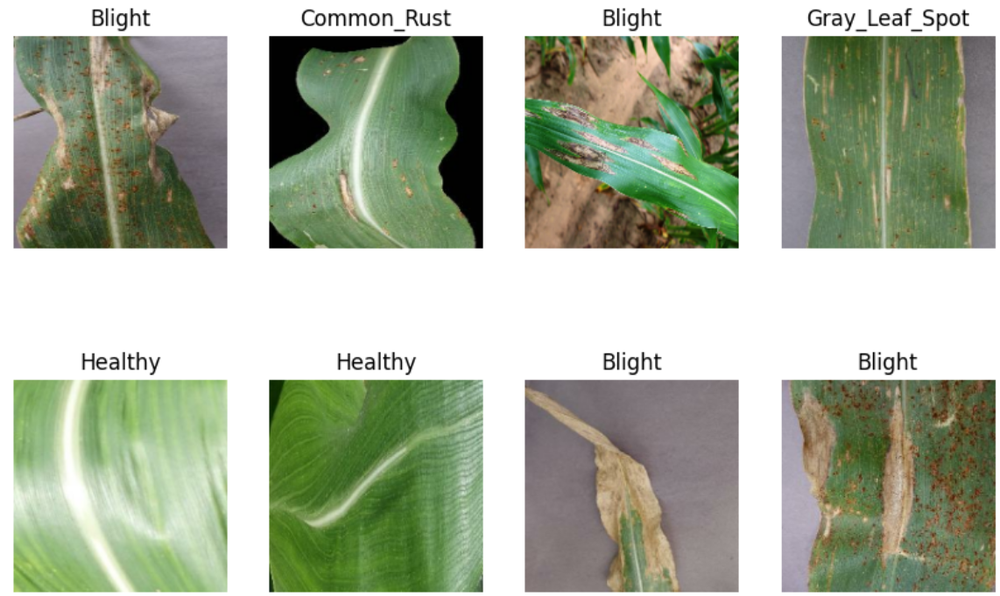

# 🍃 Leaf Disease Classification

This Repository refers to the Final Project of the course [Neural Networks for Data Science (NNDS)](https://www.sscardapane.it/teaching/nnds-2022/) at University Sapienza of Rome 2022/2023.

## Overview
This project implements a deep learning solution for classifying corn leaf diseases using convolutional neural networks (CNNs). The dataset used contains images of maize leaves, which are categorized into four classes: Common Rust, Gray Leaf Spot, Blight, and Healthy. The aim is to develop and experiment with different neural network architectures, including modular models with early exits, to optimize performance and computational efficiency.

## Dataset
The dataset used for this project is the **Corn or Maize Leaf Disease Dataset** from Kaggle. It consists of 4188 images classified into four categories:
- **Common Rust**: 1306 images
- **Gray Leaf Spot**: 574 images
- **Blight**: 1146 images
- **Healthy**: 1162 images
- 

 

  
  
  

  

  

Source: [Kaggle: Corn or Maize Leaf Disease Dataset](https://www.kaggle.com/smaranjitghose/corn-or-maize-leaf-disease-dataset)

## Project Structure
1. **Basic CNN Implementation**: A standard CNN was implemented using 4 convolutional layers, followed by global average pooling and classification layers. The model was trained on the dataset and evaluated on accuracy and loss metrics.
2. **Modular Network with Early Exits**: The model was extended to include early exits after specific convolutional blocks. The network can dynamically decide whether to exit early based on the entropy of the predictions, allowing faster inference for simpler examples.
3. **Load Balancing Regularization**: In an advanced version, a regularization term was introduced to balance the number of samples exiting at each exit, improving the overall robustness of the model.

## Model Architecture
The model follows a convolutional architecture with the following layers:
- **Convolutional Layers**: 4 blocks, each consisting of convolution, batch normalization, ReLU activation, and max pooling.
- **Early Exits**: Two early exit blocks were added after the second and third convolutional blocks.
- **Final Classifier**: A fully connected layer followed by a softmax activation to classify the images into one of the four categories.

## Data Augmentation
To improve generalization, various data augmentation techniques were applied:
- Random rotations
- Horizontal and vertical flips
- Zooming and contrast adjustment

## Results
- The best model achieved an accuracy of **91.5%** on the validation set and **89.5%** on the test set.
- The early exit mechanism allowed for faster inference by classifying simpler examples at earlier stages of the network.

## Instructions for Use
1. Clone the repository.
2. Install the required dependencies (TensorFlow, matplotlib, etc.).
3. Download the dataset from Kaggle and place it in the appropriate directory.
4. Run the notebook to train and evaluate the models.

## Future Work
- Implement other modular architectures like Mixture of Experts (MoE).
- Experiment with additional datasets and tasks.

*   70% train set
*   15% validation set
*   15% test set

